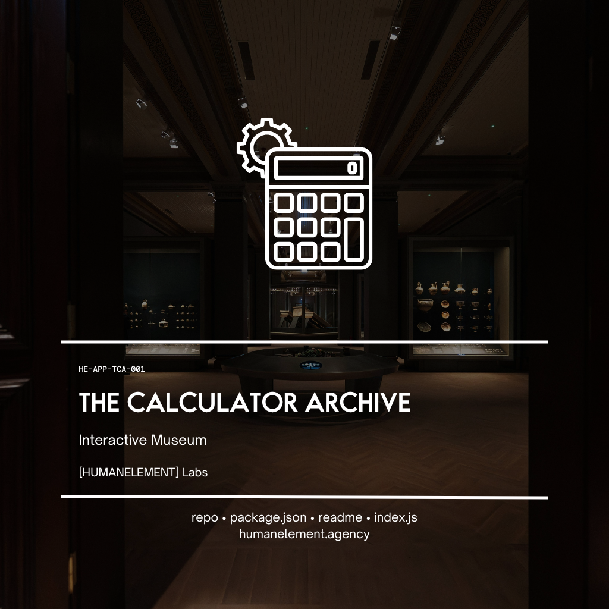

<p align="center">
  
</p>

# The Calculation Archive


> A living museum of digital calculators — from early electronic hardware to vintage software. Each calculator is preserved as a faithful software artifact.

---

## What It Is

The Calculation Archive is a dark-mode museum interface housing period-accurate interactive calculator renders. From the Sharp QT-8D's analog photograph to the dithered EGA pixels of Windows 1.0, each entry is reconstructed with attention to the era's aesthetics — display technology, button layout, color palette, and typography.

Calculators are organised into categories (Early Electronic, LED Era, Graphing, Financial, Software) with a collapsible sidebar, detail panel, and a stage that keeps each calculator as the centrepiece.

---

## Calculators

| Calculator | Year | Category | Notes |
|---|---|---|---|
| Sharp QT-8D | 1969 | Early Electronic | First mass-market LSI calculator; rendered from photograph |
| TI-30 | 1976 | LED Era | Iconic red LED display; faithful button layout |
| HP-12C | 1981 | Financial | RPN logic; gold-on-dark palette |
| Casio fx-7000G | 1985 | Graphing | World's first graphing calculator |
| Windows 1.0 Calculator | 1985 | Software | EGA-era dithered reconstruction |
| Windows 3.1 Calculator | 1992 | Software | Full scientific mode layout |

---

## Running Locally

```bash
git clone https://github.com/HumanElement-Dev/The-Calculation-Archive.git
cd The-Calculation-Archive
npm install
npm run dev
```

Open `http://localhost:5173`.

---

## Stack

- **React 18** + **TypeScript** — component-per-calculator architecture
- **Vite 5** — dev server and build tooling
- Pure inline styles — no CSS framework, no design system, full control per calculator

---

## Philosophy

Every calculator here represents a moment when someone decided *this* is what computing should feel like in the hand. The archive treats each one as an artifact worth preserving — not just the logic, but the texture.

---

<br/>

<p align="center">
  <sub>a [<a href="https://humanelement.agency">HUMANELEMENT</a> idea</sub><br/>
  <sub>made with love by <a href="https://github.com/HumanElement-Dev">HumanElement</a> and Claude</sub>
</p>
